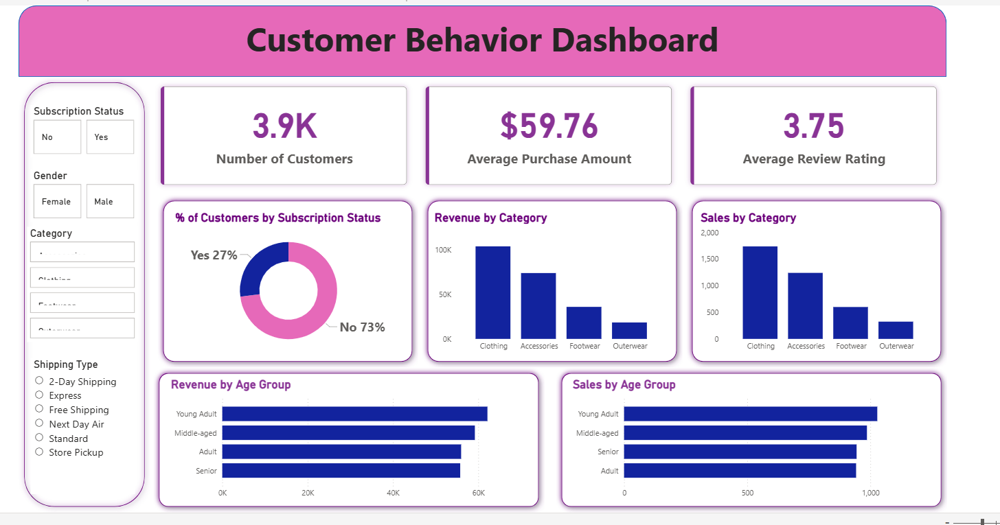

# Customer Shopping Behavior Analysis

 ## 🔗 Live Dashboard

Explore the fully interactive dashboard:

• [View Dashboard](https://app.powerbi.com/view?r=eyJrIjoiYmYxYWQ2Y2YtM2UwZC00OTdhLThlNjItYTZhYmMwN2ZmNDkyIiwidCI6ImM2ZTU0OWIzLTVmNDUtNDAzMi1hYWU5LWQ0MjQ0ZGM1YjJjNCJ9)

---

---

## The Business Problem

Retail businesses collect enormous amounts of customer transaction data every day, but most of it sit
unused. Without proper analysis, companies have no clear picture of who their customers actually are,
which products drive the most revenue, when people shop and why, or whether their promotions are actu
working.

This project tackles that problem head on. Using a dataset of 3,900 retail customers, I built a compl
analytics pipeline from raw data all the way through to a live interactive dashboard that a business 
could open right now and use to make decisions. The goal was to answer one core question: what actual
drives purchasing behavior, and what should a retail business do differently based on that data?

---

## What the Data Revealed

After cleaning the data, running SQL analysis, and building the dashboard, here are the headline find

The customer base is 3,900 people with an average spend of $59.76 per transaction and an average revi
rating of 3.75 out of 5. Clothing is the top revenue category by a clear margin, followed by Accessor
Footwear, and Outerwear. Young Adults are the highest spending age group across all categories.

Only 27% of customers are subscribers, which means there is a large untapped opportunity to convert t
remaining 73% into a loyalty program. Subscribers consistently spend more per transaction than 
non-subscribers, making this one of the clearest levers available to grow revenue without acquiring n
customers.

Shipping preference varies significantly across segments, with 2-Day Shipping and Free Shipping being
most popular options, suggesting that speed and cost matter more than other factors for the majority 
buyers.

---

## Key Numbers at a Glance

| Metric | Value |
|--------|-------|
| Total customers analysed | 3,900 |
| Average purchase amount | $59.76 |
| Average review rating | 3.75 / 5.0 |
| Subscriber rate | 27% |
| Top revenue category | Clothing |
| Highest spending age group | Young Adult |

---

## Tools and Approach

**Excel** was used at the start for initial data profiling, pivot table exploration, and a quick sani
check on the dataset before writing any code.

**Python** handled all data cleaning and exploratory analysis. The raw CSV was loaded using Pandas, 
columns were standardised, text fields were cleaned, and the dataset was explored through visualisati
built with Seaborn and Matplotlib. Once clean, the data was pushed directly into MySQL using SQLAlche

**MySQL** was used to answer business questions through structured queries. This included revenue 
breakdowns by category, season, and age group, customer segmentation using CASE statements, and advan
queries using window functions and CTEs to rank categories, identify high value customers, and calcul
running totals.

**Power BI** was used to build the final dashboard. Slicers for Subscription Status, Gender, Category
Shipping Type allow anyone to filter the data interactively. The dashboard shows KPI cards, a donut c
for subscription split, and bar charts for revenue and sales across categories and age groups.

---

## Business Recommendations

Focus subscription conversion efforts on the 73% of non-subscribers, particularly within the Young Ad
and Middle-aged segments where average spend is highest. Even a 10% conversion would significantly 
increase repeat purchase revenue.

Prioritise Clothing and Accessories in seasonal promotions since these categories dominate revenue ac
all age groups. Fall and Winter appear to drive stronger purchase volumes based on the seasonal break

Offer Free Shipping or 2-Day Shipping as default options for high-value customers, as shipping prefer
is one of the strongest filters applied by customers when making purchasing decisions.

---

## Skills Demonstrated

Python, Pandas, Seaborn, Matplotlib, MySQL, Window Functions, CTEs, Power BI, DAX, Data Visualisation
Business Intelligence, Customer Segmentation, KPI Reporting, Excel, ETL, SQLAlchemy

---

